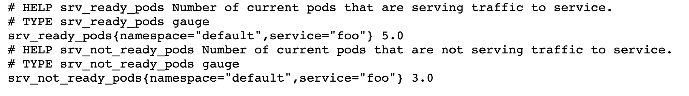

## Description

Monitors a kubernetes service and collects endpoint metrics:



* srv_ready_pods (displays current numbers of service endpoints - pods that are passing k8s startup/readiness/liveness probes)

* srv_not_ready_pods (displays current number of service pods that are not ready to serve traffic)
    - pods that are failing k8s startup/readiness/liveness probes
    - pods that can't pull image/etc
    - Note: this metric doesn't capture pods that can't be scheduled for any reason


These metrics can be:
* exported to Prometheus (prometheus format)
* sent to Honeycomb as events (json format)  

#### Run script locally, from outside the cluster

```
# create python3 virtual env
python3 -m venv venv

# activate python env
source venv/bin/activate

# install pip packages
pip install -r requirements.txt

# run script with OTEL enabled/disabled
export OTEL_API_KEY=<HONEYCOMB_API_KEY>
python main.py --service-name foo --namespace-name default --polling-interval 2 --otel-enabled True
python main.py --service-name foo --namespace-name default --polling-interval 2
```

#### Run script as k8s deployment

```
# If you send honeycomb events you need to define otel api key as secret and
# set OTEL_ENABLED env var in deployment manifest k8s/deployment.yaml
kubectl create secret generic honeycomb --from-literal=otel_api_key=<OTEL API KEY HERE>

# build container image
docker build -f Dockerfile -t andreistefanciprian/endpoints-prom-exporter:latest .
docker image push andreistefanciprian/endpoints-prom-exporter

# build k8s resources
kubectl apply -f k8s/foo_deployment.yaml
kubectl apply -f k8s/rbac.yaml
kubectl apply -f k8s/servicemonitor.yaml
kubectl apply -f k8s/deployment.yaml
```

#### Testing

```
# check app logs while testing
kubectl logs -l app=endpoints-prom-exporter -f

# testing
kubectl set image pod foo-f88c97f79-5dvph foo=nginx:fail
kubectl set image deployment foo foo=nginx:1.12.0
kubectl scale deployment foo -n default --replicas 0
kubectl scale deployment foo -n default --replicas 10

# fail liveness probe on one of the pods
kubectl exec -ti foo-f88c97f79-5dvph rm /usr/share/nginx/html/index.html

# fail liveness probe on all pods
for pod in `kubectl get pods --no-headers | grep foo | grep Running | awk '{print $1}'`; do kubectl exec -ti $pod rm /usr/share/nginx/html/index.html; done

# fail startup/readiness probe by redeploying with wrong port number for these probes
```

* Note: srv_not_ready_pods counter doesn't capture pods that can't be scheduled for any reason.
```
# cordon all nodes
for node in `kubectl get nodes --no-headers | awk '{print $1}'`; do kubectl cordon $node; done
# scale deployment
kubectl scale deployment foo -n default --replicas 5
# uncordon all nodes
for node in `kubectl get nodes --no-headers | awk '{print $1}'`; do kubectl uncordon $node; done
```